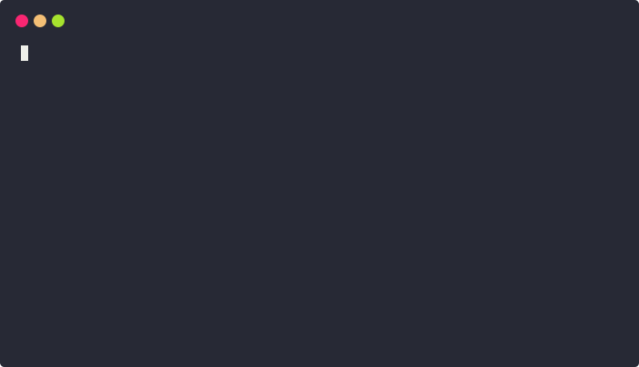

# seel <!-- omit in toc -->

[](https://github.com/kevinpollet/seel/actions)
[](https://conventionalcommits.org)
[](https://github.com/prettier/prettier)
[](./LICENSE.md)

**seel** is a command-line tool that facilitates the build of container image for your Node.js applications. You don't need to master container best practices or write a Dockerfile to build a container image for your application, it's just as simple as invoking a command from your shell or npm script.



## Table of Contents <!-- omit in toc -->

- [Install](#install)
- [Usage](#usage)
  - [CLI](#cli)
  - [API](#api)
- [Examples](#examples)
- [Contributing](#contributing)
- [License](#license)

## Install

```shell
# npm
$ npx seel                      # Run it once.
$ npm install --global seel     # Install globally.
$ npm install --save-dev seel   # Install locally to use it in npm scripts.

# yarn
$ yarn global add seel          # Install globally.
$ yarn add seel --dev           # Install locally to use it in npm scripts.
```

## Usage

> **seel** uses the Docker daemon to build the container image for your Node.js application. When you invoke the **seel** command, the Docker daemon must be **running** and **accessible** through the `/var/run/docker.sock` socket.

### CLI

#### Options <!-- omit in toc -->

| Name           | Description                                                                                                                             |
| -------------- | --------------------------------------------------------------------------------------------------------------------------------------- |
| -v, --version  | Output version.                                                                                                                         |
| -h, --help     | Output usage information.                                                                                                               |
| --cwd          | Define the current working directory, defaults to `.`.                                                                                  |
| --entrypoint   | Define the app entrypoint path relative to the current working directory, defaults to `bin` or `main` script defined in `package.json`. |
| --labels       | Define the container image labels, as a comma-separated list of key-value pairs, e.g. `--labels label1=value,label2=value`.             |
| --name         | Define the container image name, defaults to the `name` defined in `package.json`.                                                      |
| --exposedPorts | Define the ports that the app exposes at runtime, as a comma-separated list of values, e.g. `--exposedPorts 3000,4000/udp`.             |
| --tags         | Define the container image tags, as a comma-separated list of values, e.g. `--tags latest,1.0.0`.                                       |

### API

```typescript
import { join } from "path";
import { buildImage } from "seel";

const appDir = join(__dirname, "my-app");
const options = {
  name?: string;
  entrypoint?: string;
  tags?: string[];
  labels?: [string, string][];
  exposedPorts?: string[];
};

buildImage(appDir, options)
  .then(stream => stream.pipe(process.stdout))
  .catch(err => {
    console.log(err);
    process.exit(1);
  });
```

## Examples

- [hello-world-cli](./examples/hello-world-cli) - A command-line app that outputs `Hello, World!` or greets the name passed as an argument.

- [hello-world-express](./examples/hello-world-express) - An Express app that responds `{"message":"Hello, World!"}` to HTTP `GET /` requests or greets the name passed as query param.

## Contributing

Contributions are welcome!

Want to file a bug, request a feature or contribute some code?

Check out the [contribution guidelines](./CONTRIBUTING.md).

## License

[MIT](./LICENSE.md) © kevinpollet
